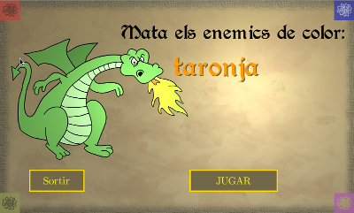

# Sir_Cavallers
Un joc senzill per provar les possibilitats que dóna LibGDX per desenvolupar programes en multiplataforma: Android, Desktop en Java, i HTML5 (també es pot fer que funcionin en IPhones©  i IPads© però jo ho ignoro)

Es tracta d'eliminar els cavallers del color especificat clicant (o prement-hi a sobre)

Generació d'executables
-------------------------
Es poden generar els programes amb Gradle (caldrà tenir Gradle i Java instal·lats en el sistema)

### Escriptori
Per executar el programa en escriptori 

    $ ./gradlew desktop:run

#### Distribució
També es pot generar un *jar* per executar-lo com es sol fer amb els programes Java: 

    $ ./gradlew desktop:dist 

Això generarà un paquet JAR executable en el directori desktop/build/libs/. Per executar-lo en la majoria de sistemes només cal fer-hi doble clic... Però també és possible fer-ho des de consola: 

    $ java -jar Princeseta.jar

### Android
Per crear el projecte en Android cal tenir el SDK instal·lat i definir una variable ANDROID_HOME que apunti al directori on est instal·lat. En Linux fem una cosa com aquesta (posant el directori correcte)

    export ANDROID_HOME=/home/usuari/Android/Sdk

Si tenim tots els requeriments només caldrà endollar un dispositiu preparat per desenvolupadors (mireu la documentació d'Android) al sistema o obrir un emulador i executar: 

    $ ./gradlew android:installDebug android:run

#### Distribució del paquet APK
Per poder-lo executar sense debug en Android cal signar-lo. De manera que és una mica més complexe. Però es pot generar el APK amb:  

    $ ./gradlew android:assembleRelease

### HTML5
Es pot executar en mode debug amb GWT amb: 

    $ ./gradlew html:superDev

Això inicia un servidor. Primer cal anar a http://localhost:9876 i després d'activar el mode Debug es pot anar a http://localhost:8080/html per veure el programa en marxa.

#### Distribució HTML5
De totes formes trobo que en HTML5 és millor simplement crear el paquet de distribució: 

    $ ./gradle html:dist
    
La web es crea a html/build/dist/. Per poder-lo executar només cal obrir un servidor web en el lloc (per exemple si tenim Python n'hi ha prou amb executar el SimpleHTTPServer): 

    $ cd html/build/dist/
    $ python -m SimpleHTTPServer

I anar amb el navegador a http://localhost:8000

